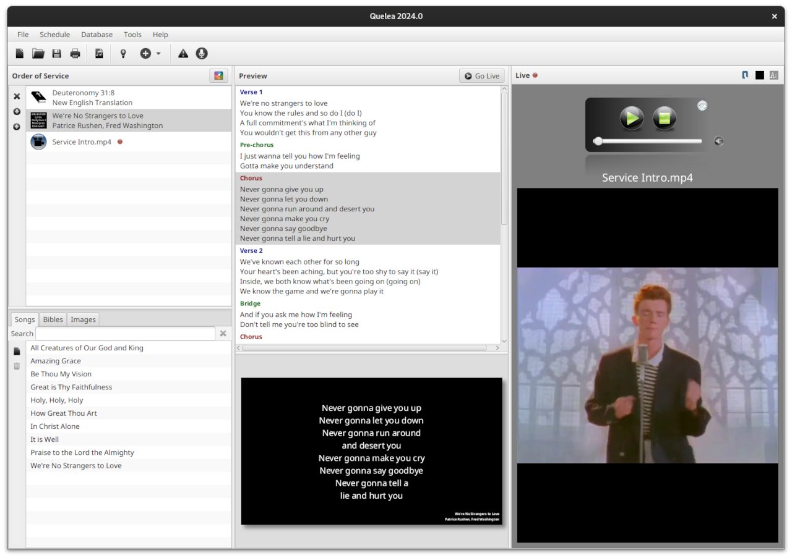

# FLC Bible Show

**A customized fork of Quelea for First Love Church, enhanced with improved Bible verse interaction and presentation features.**

## 📥 **Download Latest Version**

**Ready to use FLC Bible Show? Download the latest version here:**

[**Latest Release - Windows x64**](https://github.com/Benighter/FLC-Bible-Show/releases/latest/download/flc-bible-show-windows-x64.exe)

[**Latest Release - Cross Platform (requires Java)**](https://github.com/Benighter/FLC-Bible-Show/releases/latest/download/flc-bible-show-crossplatform.jar)

[**Latest Release - Mac**](https://github.com/Benighter/FLC-Bible-Show/releases/latest/download/flc-bible-show-mac.zip)

[**All Releases**](https://github.com/Benighter/FLC-Bible-Show/releases)

---

This is a specialized version of the popular Quelea church presentation software, forked and enhanced by **Bennet Nkolele** for First Love Church. The application maintains all the core functionality of Quelea while adding specific improvements for Bible verse presentation and interaction.

## 🚀 Key Enhancements

### ✅ **Fixed Bible Verse Clicking**
- **Problem Solved**: Individual Bible verses can now be clicked consistently without the interface becoming unresponsive
- **Technical Fix**: Resolved JavaScript bridge communication issues that were causing WebView reloads
- **User Experience**: Smooth navigation between verses with reliable highlighting and live display functionality

### 🎯 **Improved Bible Navigation**
- Enhanced verse-by-verse navigation in the Bible panel
- Consistent verse highlighting synchronized with live display
- Reliable JavaScript bridge for seamless interaction between Java and WebView components

### 🔧 **Technical Improvements**
- Fixed WebView content reload issues that broke JavaScript functionality
- Improved error handling in Bible verse interaction
- Enhanced debugging and logging for better troubleshooting

## 👨‍💻 **About the Developer**

**Bennet Nkolele** - Full Stack Developer & Software Engineer

* 🌐 **Portfolio:** [https://react-personal-portfolio-alpha.vercel.app/](https://react-personal-portfolio-alpha.vercel.app/)
* 💻 **GitHub:** [https://github.com/Benighter](https://github.com/Benighter)
* 🔗 **LinkedIn:** [https://www.linkedin.com/in/bennet-nkolele-321285249/](https://www.linkedin.com/in/bennet-nkolele-321285249/)

## 📋 **Fork Information**

This project is forked from the original [Quelea Projection Software](https://github.com/quelea-projection/Quelea) and customized specifically for First Love Church's presentation needs. All original Quelea functionality is preserved while adding targeted improvements for Bible verse interaction.

**Original Quelea Project:** [https://github.com/quelea-projection/Quelea](https://github.com/quelea-projection/Quelea)



## 🛠️ **Building from Source**

### Prerequisites
- Java 17 or higher
- Gradle (included via wrapper)

### Build Instructions
```bash
# Clone the repository
git clone https://github.com/Benighter/FLC-Bible-Show.git
cd FLC-Bible-Show

# Build the application
./gradlew build

# Run the application
./gradlew run
```

### Creating Distribution
```bash
# Create distribution packages
./gradlew distTar distZip
```

## 📥 **Installation Options**

### FLC Bible Show (This Fork)
- **Recommended**: Download from the [releases section](https://github.com/Benighter/FLC-Bible-Show/releases) above
- **Build from source**: Follow the build instructions below

### Original Quelea
For the original Quelea software, visit the [official Quelea releases](https://github.com/quelea-projection/Quelea/releases).

## 📚 **Documentation**

For general Quelea usage documentation, visit the [official Quelea documentation](https://quelea-projection.github.io/docs/).

### FLC Bible Show Specific Features
- **Bible Verse Clicking**: Click individual verses in the Bible panel to highlight and display them live
- **Enhanced Navigation**: Improved verse-by-verse navigation with consistent highlighting
- **Reliable Interaction**: Fixed JavaScript bridge ensures consistent verse clicking functionality

## 🐛 **Found a Bug?**

For issues specific to this FLC Bible Show fork:
- [Create an issue](https://github.com/Benighter/FLC-Bible-Show/issues) in this repository
- Provide detailed steps to reproduce the problem
- Include your debug log if possible

For general Quelea issues:
- Report to the [original Quelea repository](https://github.com/quelea-projection/Quelea/issues)

## 🤝 **Contributing**

Contributions are welcome! Whether it's bug fixes, feature enhancements, or documentation improvements:

1. Fork the repository
2. Create a feature branch (`git checkout -b feature/amazing-feature`)
3. Commit your changes (`git commit -m 'Add amazing feature'`)
4. Push to the branch (`git push origin feature/amazing-feature`)
5. Open a Pull Request

## 📄 **License**

This project maintains the same license as the original Quelea project. See the original [Quelea repository](https://github.com/quelea-projection/Quelea) for license details.

## 🙏 **Acknowledgments**

- **Original Quelea Team**: For creating the excellent foundation that this fork builds upon
- **First Love Church**: For providing the use case and requirements that drove these enhancements
- **Open Source Community**: For the tools and libraries that make this project possible

---

**Made with ❤️ by [Bennet Nkolele](https://github.com/Benighter) for First Love Church**
